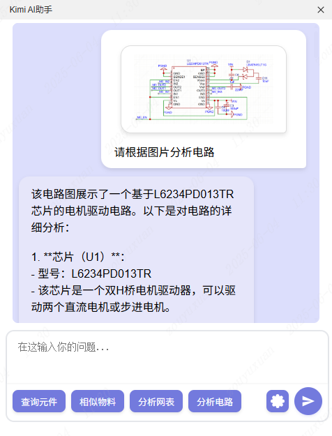
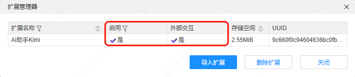
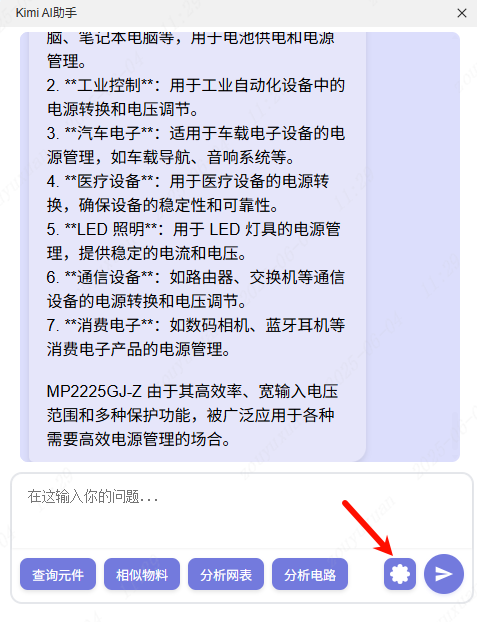
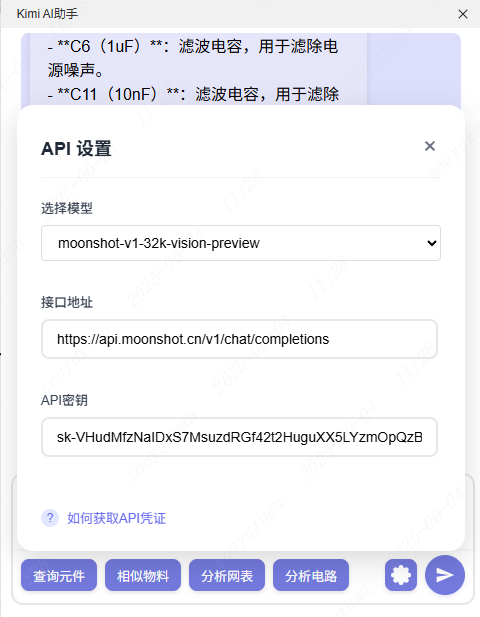
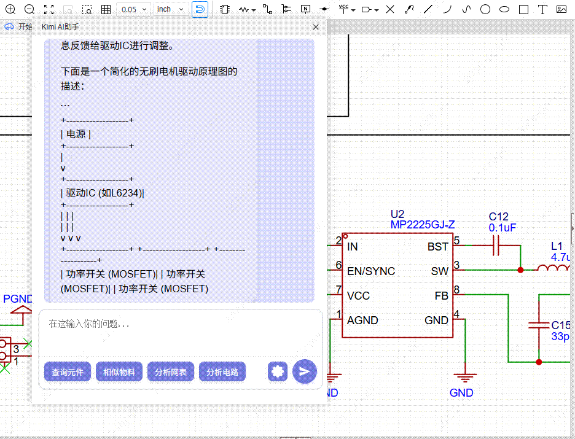
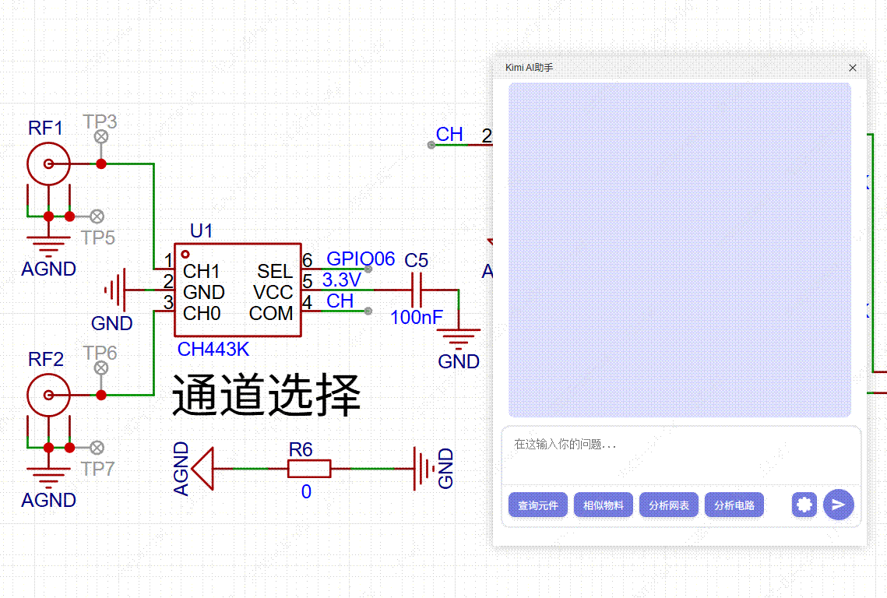
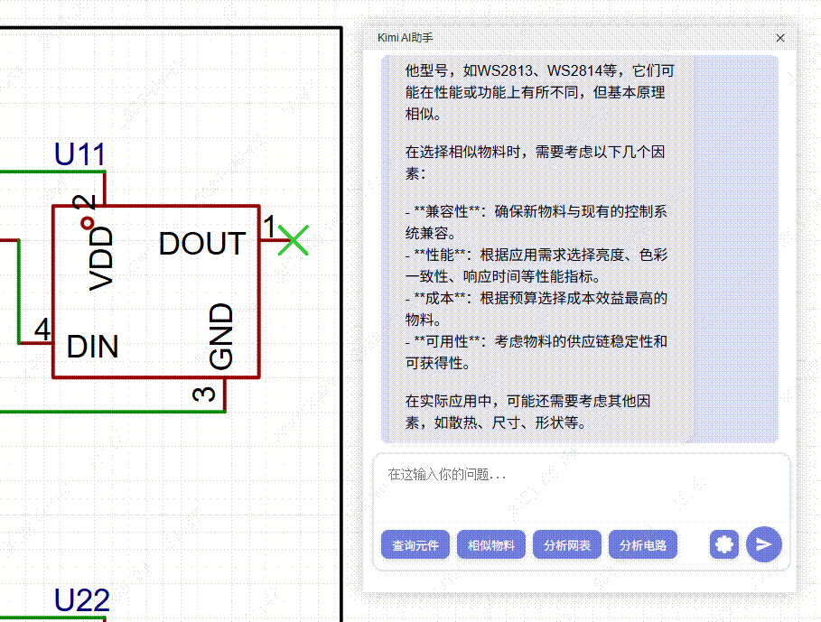
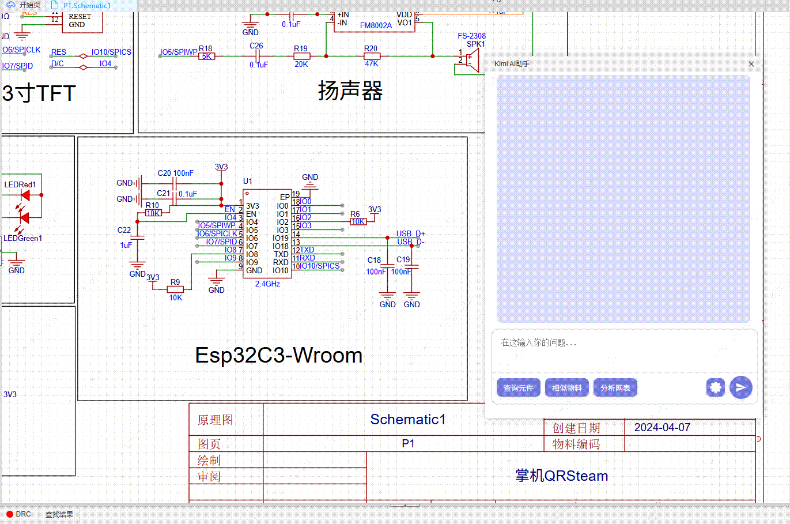
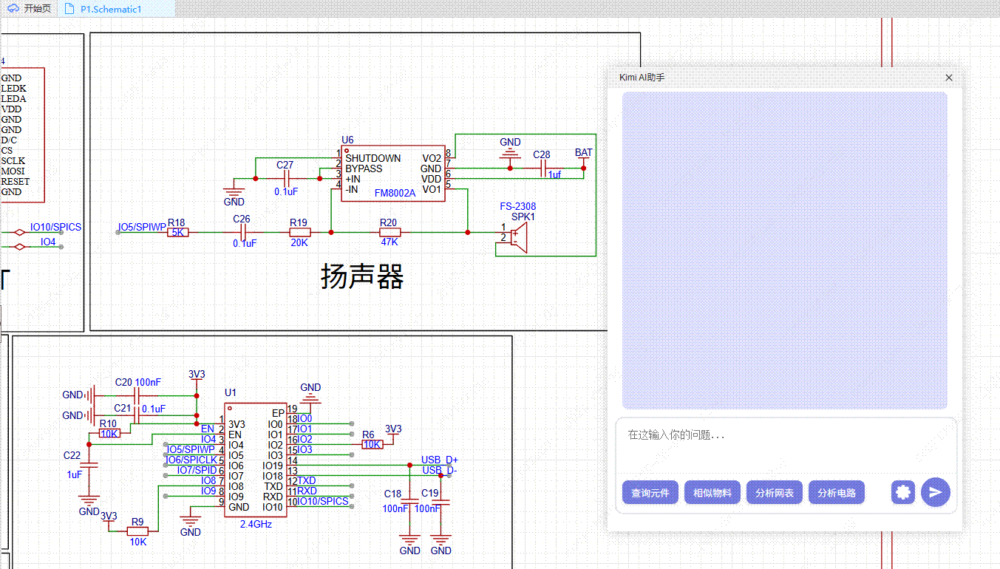

# Kimi AI Assistant

[中文](./README.md)

## Overview

Kimi AI Assistant is an intelligent tool developed for PCB designers, offering the following core features:

1. **Content Query**: During PCB design, users can quickly query needed design content through AI conversations.
2. **Component Management**: Supports component selection and detailed information queries, including similar part recommendations, netlist parsing, and circuit analysis.
3. **Intelligent Interaction**: Achieves efficient content retrieval and problem-solving through AI conversations.

## Feature Access

Users can access the following features through the top menu bar:

- Kimi > Kimi AI Assistant
- Kimi > About

## Usage Instructions

1. Enable the extension in the Extension Manager and make sure **External Interaction** is turned on.

   

2. Click the configuration button in the bottom right corner, and fill in the API Key on the configuration page.

   

3. Fill in the API Key in the configuration panel. For details on obtaining Kimi API credentials, see: [Kimi API Acquisition Guide](https://lceda001.feishu.cn/wiki/V9ScwIjk0iBc8fk9RhWcork9nGc)

   

## Feature Introduction

### AI Q&A

Enter questions related to schematic or PCB design in the input box, and the AI will provide professional answers based on your questions.

### Component Query

Click the **Query Component** button at the bottom, then left-click on a component in the schematic to query its detailed information.

### Similar Part Recommendations

Click the **Similar Parts** button at the bottom, then left-click on a component in the schematic to query replacement parts for that component.

### Netlist Analysis

Click the **Analyze Netlist** button at the bottom, and the AI will analyze the netlist in the schematic and provide detailed analysis results.

> Note: This feature consumes a large number of Tokens and will be optimized in future versions.

### Circuit Diagram Analysis

After selecting a vision model, you can click the **Analyze Circuit** button or directly press Ctrl + V to paste an image into the input box. The assistant will analyze and respond with the circuit diagram content.

