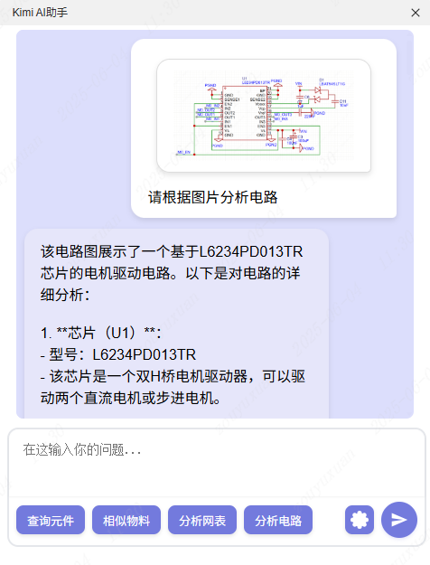
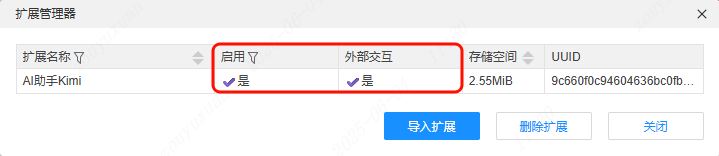
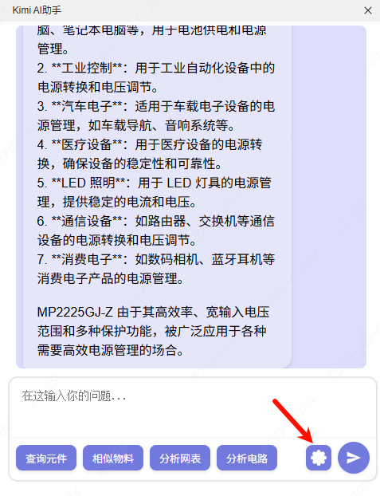
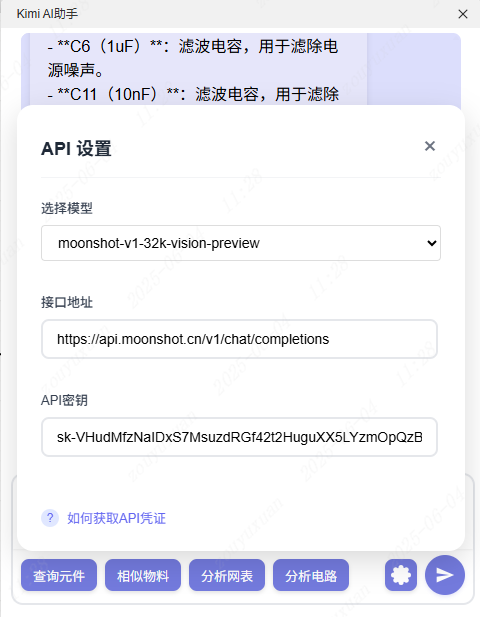
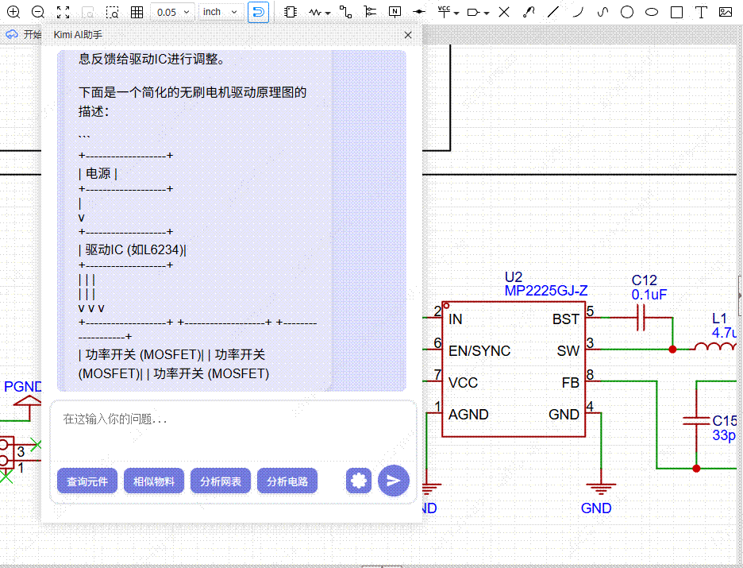
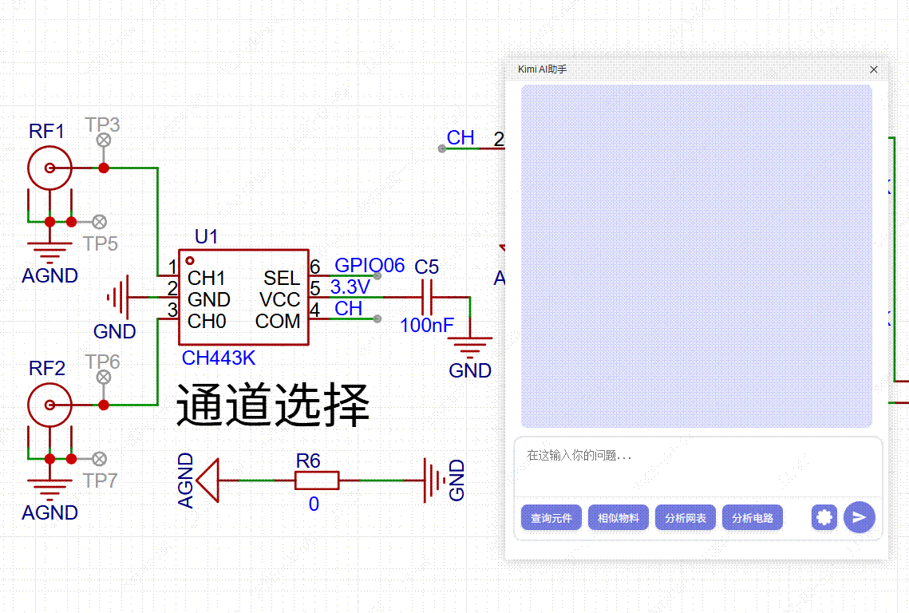
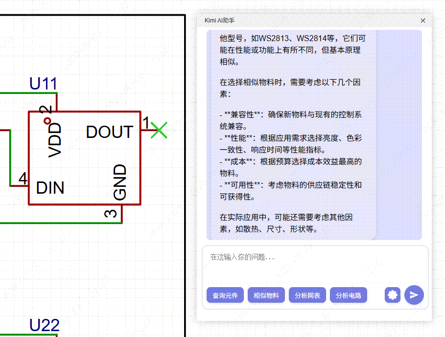
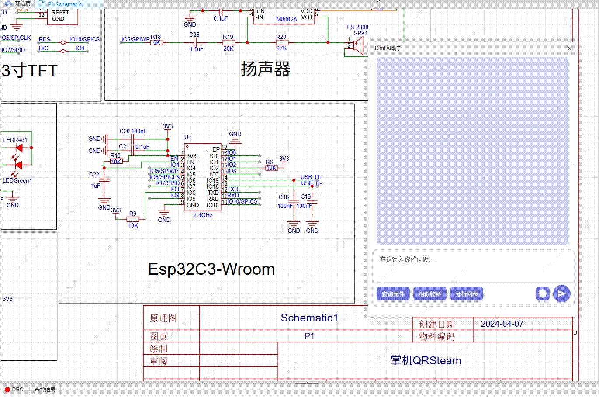
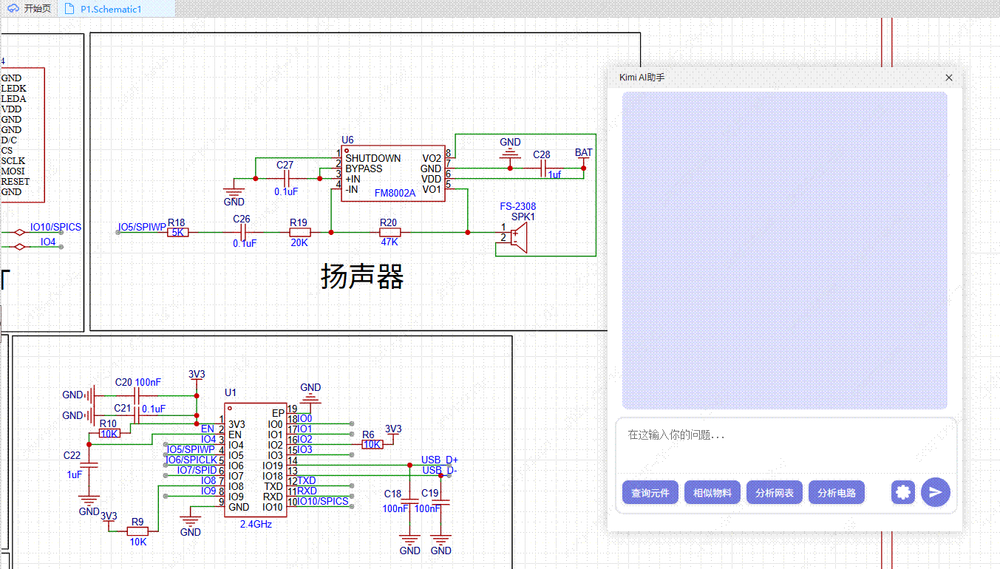

# Kimi AI 助手

## 功能概述

Kimi AI 助手是一款专为 PCB 设计人员开发的智能工具，具备以下核心功能：

1. **内容查询**：在 PCB 设计过程中，用户可通过 AI 对话快速查询所需设计内容。
2. **元件管理**：支持元件选取与详细信息查询，包括相似物料推荐、网表解析及电路分析。
3. **智能交互**：通过 AI 对话实现高效内容检索与问题解答。

## 功能入口

用户可通过顶部菜单栏访问以下功能：

- Kimi > Kimi AI 助手
- Kimi > 关于

## 使用说明

1. 在扩展管理器中启用扩展，并确保已开启 **外部交互**。

   

2. 点击右下角配置按钮，在配置页面中填写 API 密钥。

   

3. 在配置面板中填写 API 密钥。Kimi API 凭证获取方式详见：[Kimi API 获取指南](https://lceda001.feishu.cn/wiki/V9ScwIjk0iBc8fk9RhWcork9nGc)

   

## 功能介绍

### AI 问答

在输入框中输入原理图或 PCB 绘制的相关问题，AI 会根据问题给出专业回答。

### 元件查询

点击底部 **查询元件** 按钮，再左键点击原理图上的元件，即可查询元件的详细信息。

### 相似物料推荐

点击底部 **相似物料** 按钮，再左键点击原理图上的元件，即可查询该元件的替换物料。

### 网表分析

点击底部 **分析网表** 按钮，AI 会分析原理图中的网表，并给出详细分析结果。

> 注：此功能 Tokens 消耗较大，后续版本将进行优化。

### 电路图分析

选择视觉模型后，支持点击 **分析电路** 按钮或直接 Ctrl + V 粘贴图片到输入框，助手将会分析并回复电路图内容。

